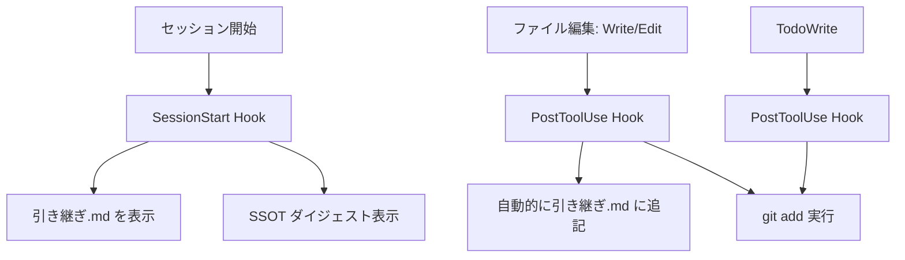
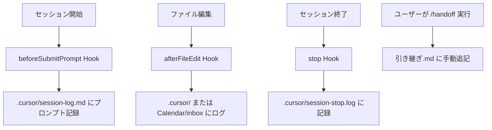

# 運用フロー分析: Claude Code vs Codex/Cursor

**作成日**: 2025-12-29
**目的**: Claude Code CLI と Codex/Cursor 間の引き継ぎが機能しない理由を分析し、解決策を提示する

> ⚠️ この分析は **旧方式（Vaultの `System/Documentation/引き継ぎ.md`）前提**です。
> 現行は「repo直下 `handoff.md` をSSOT」とし、`handoff` / `endwork` で更新します。
> この文書内の `引き継ぎ.md` / `/handoff` / `handoff-add.sh` は **旧方式の説明**です（現行手順として実行しません）。

---

## 📊 問題の要約

引き継ぎフローが期待通りに機能していない主な理由:

1. **自動記録の有無**: Claude Code は自動、Cursor は手動
2. **記録先の違い**: 各ツールが異なる場所にログを保存
3. **トリガーの仕組み**: "add トリガー" の概念が各ツールで異なる

---

## 🔄 現在の運用フロー比較

### Claude Code CLI のフロー



**特徴**:
- ✅ **完全自動**: ファイル編集時に引き継ぎ.md へ自動追記
- ✅ **即時反映**: 各編集後すぐにログが更新される
- ✅ **git 連携**: 自動で `git add` を実行
- ✅ **SSOT 表示**: セッション開始時に意思決定・パターン・ガードレールを表示

### Codex/Cursor のフロー



**特徴**:
- ❌ **手動トリガー**: `/handoff` コマンドを明示的に実行する必要がある
- ❌ **別の記録先**: `.cursor/` ディレクトリや `Calendar/inbox` に記録
- ⚠️ **引き継ぎ.md への反映が遅延**: ユーザーが `/handoff` を忘れると記録されない
- ⚠️ **git 連携なし**: 手動で `git add` が必要

---

## 🎯 "トリガー" の正体

### 記憶トリガー (Memory Trigger)

| ツール | トリガー内容 | 実行タイミング |
|--------|------------|--------------|
| **Claude Code** | SessionStart Hook | セッション開始時に自動 |
| **Cursor** | beforeSubmitPrompt Hook | プロンプト送信前に自動 |

**Claude Code の記憶トリガー詳細**:
```bash
# .claude/settings.local.json の SessionStart Hook
System/Scripts/session-init-mem.sh を実行
↓
Atlas/意思決定.md, Atlas/パターン.md, Atlas/ガードレール.md から最新3件を抽出
↓
SSOT ダイジェストとして表示
```

**Cursor の記憶トリガー詳細**:
```bash
# .cursor/hooks.json の beforeSubmitPrompt
log-prompt.sh を実行
↓
.cursor/ ディレクトリにプロンプトログを保存
```

➡️ **問題**: Cursor は `.cursor/` 配下にしか記録せず、SSOT ダイジェストを表示しない

---

### 追加トリガー (Add Trigger)

| ツール | トリガー内容 | 実行タイミング |
|--------|------------|--------------|
| **Claude Code** | PostToolUse(Write/Edit) Hook | ファイル編集後に自動 |
| **Cursor** | `/handoff` コマンド | ユーザーが手動実行 |

**Claude Code の追加トリガー詳細**:
```bash
# .claude/settings.local.json の PostToolUse Hook
ファイルパス $f を取得
↓
引き継ぎ.md に "- HH:MM $f" の形式で自動追記
↓
git add $f を自動実行
```

**コード抜粋**:
```bash
log_file="$HOME/Library/Mobile Documents/iCloud~md~obsidian/Documents/SecondBrain/System/Documentation/引き継ぎ.md";
today=$(date +%Y-%m-%d);
if [ -n "$f" ] && ! echo "$f" | grep -q '引き継ぎ'; then
  if ! grep -q "^## $today$" "$log" 2>/dev/null; then
    printf "\n## %s\n\n" "$today" >> "$log" 2>/dev/null || true;
  fi;
  echo "- $(date +%H:%M) $f" >> "$log" 2>/dev/null || true;
fi;
```

**Cursor の追加トリガー詳細**:
```bash
# ユーザーが /handoff を実行
.cursor/commands/handoff.md のスクリプトを実行
↓
System/Scripts/handoff-add.sh を呼び出し
↓
引き継ぎ.md に手動で追記
```

➡️ **問題**: Cursor は自動追記されないため、ユーザーが `/handoff` を実行し忘れると記録が失われる

---

## 🐛 なぜ引き継ぎがうまくいかないのか

### 根本原因

1. **記録の非対称性**:
   - Claude Code: `System/Documentation/引き継ぎ.md` に自動記録
   - Cursor: `.cursor/` や `Calendar/inbox` に記録、引き継ぎ.md には手動追記が必要

2. **AGENTS.md の想定と実装の乖離**:
   ```markdown
   > セッション終了時: `System/Documentation/引き継ぎ.md` に変更ファイルを追記
   > （Claude Codeは自動、Codex/Cursorは /handoff）
   ```
   - AGENTS.md は `/handoff` の実行を前提としているが、ユーザーが実行を忘れる可能性がある

3. **SSOT ダイジェストの不在**:
   - Claude Code: セッション開始時に意思決定・パターン・ガードレールを自動表示
   - Cursor: このメカニズムが存在しない → 文脈が不足する

---

## 💡 解決策の提案

### 🥇 推奨案: Cursor の自動化強化

**実装内容**:
1. `.cursor/hooks/` に新しいスクリプトを追加: `auto-handoff.sh`
2. `afterFileEdit` Hook で `auto-handoff.sh` を呼び出し
3. Claude Code と同じロジックで `引き継ぎ.md` に自動追記

**メリット**:
- ✅ ユーザーの手動操作不要
- ✅ Claude Code と Cursor の動作が統一される
- ✅ 記録漏れがなくなる

**デメリット**:
- ⚠️ Cursor 側の Hook 設定を変更する必要がある
- ⚠️ 意図しないファイルも記録される可能性（フィルタリングロジックが必要）

---

### 🥈 代替案A: 統一ハンドオフスクリプト

**実装内容**:
1. `System/Scripts/unified-handoff.sh` を作成
2. Claude Code と Cursor の両方から呼び出し可能
3. 引き継ぎ.md への追記ロジックを一元化

**メリット**:
- ✅ 一貫性のあるログフォーマット
- ✅ 両ツールで同じスクリプトを使用

**デメリット**:
- ⚠️ Claude Code は既に自動化されているため、統合の必要性が低い
- ⚠️ Cursor 側は依然として手動実行が必要

---

### 🥉 代替案B: Cursor セッション開始時に SSOT 表示

**実装内容**:
1. `.cursor/hooks/session-start.sh` を作成
2. `beforeSubmitPrompt` Hook で実行
3. `System/Scripts/session-init-mem.sh` と同様に SSOT ダイジェストを表示

**メリット**:
- ✅ Cursor セッション開始時に文脈を提供
- ✅ Claude Code と同じ情報をユーザーに提示

**デメリット**:
- ⚠️ 引き継ぎの自動記録は解決しない（別途対応が必要）

---

### 🎖️ 代替案C: 明確な手動ワークフロー + リマインダー

**実装内容**:
1. AGENTS.md に Cursor 使用時の明確な手順を記載
2. `.cursor/hooks/stop.sh` で「`/handoff` を実行しましたか？」とリマインド表示

**メリット**:
- ✅ 実装が簡単
- ✅ ユーザーの意識付けができる

**デメリット**:
- ❌ 依然として手動操作が必要
- ❌ 記録忘れのリスクが残る

---

## 📋 実装優先度

| 優先度 | 施策 | 工数 | 効果 |
|-------|-----|------|-----|
| **P0** | Cursor の `afterFileEdit` Hook に自動ハンドオフ追加 | 1-2時間 | 高 |
| **P1** | Cursor セッション開始時に SSOT ダイジェスト表示 | 30分-1時間 | 中 |
| **P2** | AGENTS.md に詳細なワークフロー記載 | 30分 | 低 |
| **P3** | 統一ハンドオフスクリプト作成 | 1-2時間 | 低 |

---

## 🛠️ 次のステップ

1. **P0 施策の実装**: `.cursor/hooks/auto-handoff.sh` を作成
2. **P1 施策の実装**: `.cursor/hooks/session-start.sh` を作成
3. **動作検証**: Cursor でファイル編集 → 引き継ぎ.md に自動追記されるか確認
4. **AGENTS.md 更新**: 新しいワークフローを反映

---

## 🔗 関連ファイル

- **Claude Code 設定**: `.claude/settings.local.json`
- **Cursor 設定**: `.cursor/hooks.json`
- **引き継ぎログ**: `System/Documentation/引き継ぎ.md`
- **ハンドオフスクリプト**: `System/Scripts/handoff-add.sh`
- **SSOT ダイジェスト**: `System/Scripts/session-init-mem.sh`
- **運用ルール**: `AGENTS.md`

---

## 📝 まとめ

**問題の本質**:
- Claude Code は **自動化** されているが、Cursor は **手動操作** が必要
- "add トリガー" = Claude Code では PostToolUse Hook、Cursor では `/handoff` コマンド
- 記録先が異なるため、引き継ぎ情報が統合されない

**推奨アクション**:
1. Cursor の Hook を強化して自動ハンドオフを実装
2. セッション開始時に SSOT ダイジェストを表示
3. 両ツールの動作を統一して、シームレスな引き継ぎを実現

これにより、Claude Code CLI ↔ Codex/Cursor 間の引き継ぎが **自動化** され、記録漏れがなくなります。
