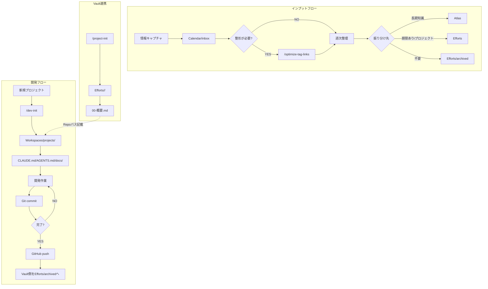

# 運用フロー - 2つの動線

このドキュメントは、SecondBrain（Vault）と Workspaces（ローカル開発）を連携させる**2つの主要動線**を定義します。

> **覚えること**: 「インプットはCalendar/inbox」「開発はWorkspaces/projects」

---

## 全体像（フローチャート）



---

## 動線1: インプットフロー

### 目的
- 日々の情報（メモ、URL、アイデア）を確実にキャプチャし、適切な場所に整理する
- 「どこに置く？」を考えずに済むフローを確立する

### ステップ

| ステップ | やること | ツール/コマンド | 出力先 |
|---------|---------|----------------|--------|
| 1. キャプチャ | とりあえずメモ | Obsidian / Web Clipper | `Calendar/inbox/` |
| 2. 整形（任意） | タグ・リンク付与 | `/optimize-tag-links` | `Calendar/inbox/`（移動しない） |
| 3. 振り分け | 週1回の整理 | `/organize-input` | 各フォルダへ移動 |

### 詳細

#### Step 1: キャプチャ（0〜30秒）
- **入口の固定**: 新規ノートは必ず `Calendar/inbox/` へ
- **ルール**: 1行でもOK、URLだけでもOK
- **設定推奨**: Obsidian → 設定 → ファイルとリンク → 「新規ファイルの作成場所」を `Calendar/inbox/` に

#### Step 2: 整形（任意、1〜3分）
- **目的**: 検索しやすくする（移動はしない）
- **コマンド**: `/optimize-tag-links`
- **代替プロンプト**: `System/prompts/20250113_03_Input整形.md`

#### Step 3: 振り分け（週1回、10〜30分）
- **目的**: `Calendar/inbox/` を軽くして、Vault構造を維持
- **コマンド**: `/organize-input`（移動まで実行）
- **代替（提案のみ）**: `/inbox-review`

### 振り分け先の判定

```
┌─ 3ヶ月後も見る？
│   YES → Atlas
│   NO ↓
│
┌─ 期限あり/進行中？
│   YES → Efforts
│   NO ↓
│
└─ よくわからない
    → Calendar/inbox（残す）または Efforts/archived（終了）
```

---

## 動線2: 開発フロー

### 目的
- 新規開発プロジェクトを「迷わず」開始できるようにする
- ノート（Vault）とコード（Workspaces）の連携を標準化する

### ステップ

| ステップ | やること | ツール/コマンド | 出力先 |
|---------|---------|----------------|--------|
| 1. ローカル初期化 | フォルダ+ファイル作成 | `/dev-init` | `~/Workspaces/projects/<project>/` |
| 2. Vault初期化 | 管理ノート作成 | `/project-init` | `Efforts/<project>/` |
| 3. 連携 | Repoパス記載 | 手動 | `00-概要.md` |
| 4. 開発 | 実装+テスト | Claude Code / Codex | ローカル |
| 5. 保存 | Git commit/push | git / gh | GitHub |
| 6. 完了 | ステータス更新 | 手動 | `Efforts/archived/` へ移動 |

### 詳細

#### Step 1: ローカル初期化
```bash
# Cursorで実行
/dev-init my-project node

# テスト/一時用途（Gitなし）
/dev-init my-project --no-git

# 作成されるもの
~/Workspaces/projects/my-project/
├── CLAUDE.md      # Claude Code用ルール
├── AGENTS.md      # Codex用ルール
├── README.md      # プロジェクト概要
├── .gitignore     # Git除外設定
├── .vscode/        # エディタ用（ローカル）
│   └── tasks.json  # claude/codex ターミナル起動タスク
├── .cursor/        # Cursor用（必要なら）
│   ├── commands/
│   │   ├── codex-review.md
│   │   └── git-checkpoint.md
│   └── rules/
│       └── ai-workflow.md
├── docs/          # 設計メモ
├── samples/       # サンプルデータ（Git管理外）
└── deliverables/  # 成果物（Git管理外）
```

#### Step 1.5: Agent Skills（Codex / Cursor）
Codex/Cursorで使うSkillは **Vaultを原本**にして運用します。

- 原本: `System/Skills/`
- 同期: `./System/Scripts/sync-codex-skills.sh`
- 反映先: `~/.codex/skills/`
- Cursor: Nightlyのみ対応（`Cmd+Shift+J` → Beta → Nightly）/ Cursor Settings → Rules → Import Settings → Agent Skills
- Cursor（安定版/無効時）: `.cursor/commands/` を使う（`codex-review`, `git-checkpoint`）

#### Step 2: Vault初期化
```bash
# Cursorで実行
/project-init my-project active

# 作成されるもの
Efforts/my-project/
├── 00-概要.md
└── (関連ノート)
```

#### Step 3: 連携（重要）
`00-概要.md` の「作業フォルダ」欄に記入:
```markdown
## 📁 作業フォルダ（ローカル/外部）
- Repo（コード）: ~/Workspaces/projects/my-project/
- GitHub URL: https://github.com/JUN-CDI/my-project
```

#### Step 4-5: 開発サイクル
1. Vault の `00-概要.md` で目的・制約を確認
2. ローカルで実装（Claude Code / Codex）
3. 動作確認
4. チェックポイント（差分を固定）: `git add -p` → `git diff --staged`
5. Git commit（小さく、こまめに）
6. 区切りのよいタイミングで GitHub push

補足:
- `/dev-init` はデフォルトでGit初期化を行う（対話時は確認あり）
- テスト/プレイグラウンド用途は `--no-git` を付ける

#### Step 5.5: 引き継ぎ（必要時）
- 引き継ぎテンプレ: [[引き継ぎ-開発作業]]
- Claude Code Skill: `dev-handoff`

#### Step 6: 完了時
- Vault: `Efforts/<project>/` → `Efforts/archived/<project>/` に移動
- GitHub: 必要なら Archive

---

## ツール使い分け

| 場面 | 推奨ツール | 理由 |
|-----|-----------|------|
| **コード編集・生成** | Claude Code (VSCode拡張) | メインの作業環境、コンテキスト維持 |
| **並列タスク・重い処理** | Codex | バックグラウンド実行可能 |
| **ブラウザテスト** | Cursor | ブラウザ機能内蔵 |
| **Vault整理** | Cursor or Claude Code | `/organize-input`等のコマンド |
| **Git操作** | Claude Code | 直接実行可能 |

---

## コマンド早見表

| 場面 | コマンド | 説明 |
|-----|---------|------|
| メモ整形 | `/optimize-tag-links` | タグ・リンク最適化 |
| メモ振り分け提案 | `/inbox-review` | 移動先を提案のみ |
| メモ振り分け実行 | `/organize-input` | 実際に移動まで実行 |
| 開発フォルダ作成 | `/dev-init <name> [type]` | ローカルに開発環境作成 |
| Vault側プロジェクト作成 | `/project-init <name> [status]` | Vaultに管理ノート作成 |
| 週次ダッシュボード | `/create-dashboards weekly` | 週次ダッシュボード更新 |

---

## クイックスタート

### 新しいアイデアをメモしたい
```
1. Calendar/inbox/ に新規ファイル作成
2. 書く
3. 終わり（週末に /organize-input で整理）
```

### 新しい開発プロジェクトを始めたい
```
1. /dev-init my-project node --github
2. /project-init my-project active
3. 00-概要.md にRepoパス記載
4. 開発開始
```

---

## ターミナルから直接実行

Claude Code CLIを使って、ターミナルから直接実行できます。

```bash
# Vaultディレクトリで実行
cd ~/Library/Mobile\ Documents/iCloud~md~obsidian/Documents/SecondBrain

# 週次整理（自動化スクリプト）
./System/Scripts/weekly-organize.sh

# 新規プロジェクト作成
./System/Scripts/dev-init.sh my-project node --github

# 更新チェック
./System/Scripts/check-updates.sh --save

# Codex Skills 同期
./System/Scripts/sync-codex-skills.sh

# Claude Code CLI直接
claude -p "Calendar/inboxを整理して" --max-turns 10
```

詳細: [[System/Documentation/Claude-Code-Skills-Scripts]]

---

## 関連ドキュメント

- [[System/Documentation/運用ガイド-全体像]] - システム全体像
- [[System/Documentation/Claude-Code-Skills-Scripts]] - Skills & Scripts
- [[System/Documentation/ファイル配置ルール-AGENTS-CLAUDE-プロンプト]] - ファイル配置ルール
- [[.cursor/commands/README]] - コマンド一覧
- [[System/prompts/README]] - プロンプト集
- [[System/prompts/00_最小運用-回し方]] - 最小運用ガイド
